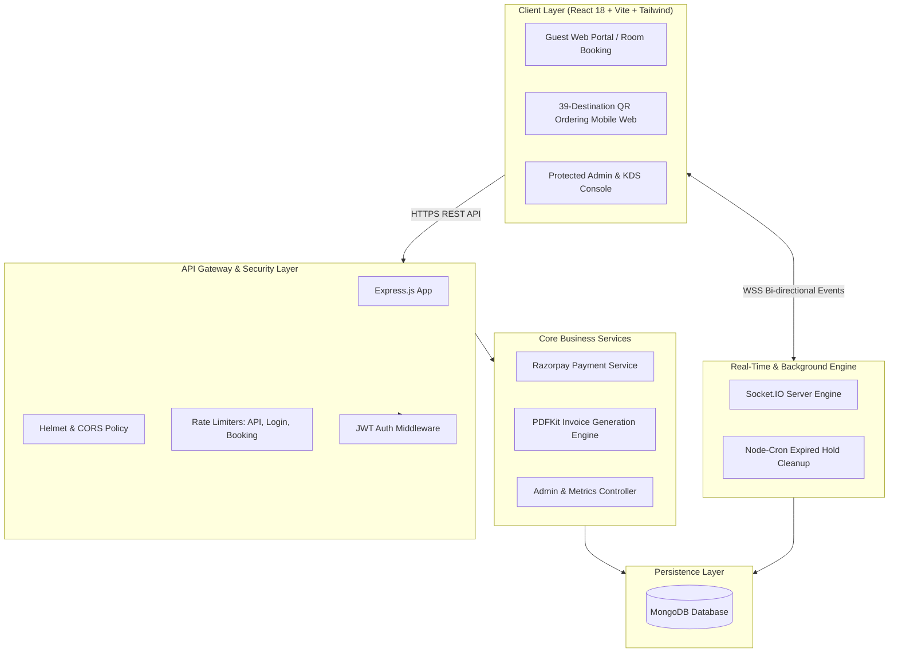

<div align="center">

# 🏰 Hotel Raama
### *Luxury Hospitality & Real-Time QR Dining Platform*

[](https://www.typescriptlang.org/)
[](https://react.dev/)
[](https://nodejs.org/)
[](https://expressjs.com/)
[](https://www.mongodb.com/)
[](https://socket.io/)
[](https://tailwindcss.com/)
[](https://vitejs.dev/)

<p align="center">
  <b>A full-stack, editorial luxury hotel management web platform engineered for Hotel Raama, Hassan, Karnataka.</b><br>
  Combines an Awwwards-inspired luxury guest reservation portal, 39-endpoint contactless QR room & venue dining system, real-time Kitchen Display System (KDS), and high-security administrative operations console.
</p>

[Key Features](#-key-features) •
[Architecture](#-system-architecture) •
[Tech Stack](#-technology-stack) •
[Quick Start](#-quick-start--installation) •
[API Documentation](#-api-endpoints-reference) •
[Socket.IO Events](#-real-time-websocket-events) •
[Environment Variables](#-environment-variables) •
[Deployment](#-production-deployment)

</div>

---

## 📖 Table of Contents

- [Overview](#-overview)
- [Key Features](#-key-features)
  - [1. Luxury Guest Portal & Room Booking](#1-luxury-guest-portal--room-booking)
  - [2. 39-Endpoint QR Dining & Bar Ordering](#2-39-endpoint-qr-dining--bar-ordering)
  - [3. Kitchen Display System (KDS) & Operations](#3-kitchen-display-system-kds--operations)
  - [4. Automated Billing & PDF Invoice Generation](#4-automated-billing--pdf-invoice-generation)
- [System Architecture](#-system-architecture)
- [Project Directory Structure](#-project-directory-structure)
- [Technology Stack](#-technology-stack)
- [Quick Start & Installation](#-quick-start--installation)
  - [Prerequisites](#prerequisites)
  - [Step 1: Clone Repository](#step-1-clone-the-repository)
  - [Step 2: Backend Setup & Configuration](#step-2-backend-setup--configuration)
  - [Step 3: Frontend Setup & Configuration](#step-3-frontend-setup--configuration)
  - [Step 4: Database Seeding](#step-4-seed-the-database)
  - [Step 5: Run Development Servers](#step-5-run-development-servers)
- [API Endpoints Reference](#-api-endpoints-reference)
- [Real-Time WebSocket Events](#-real-time-websocket-events)
- [Environment Variables](#-environment-variables)
- [Database Models & Schema](#-database-models--schema)
- [Security & Reliability](#-security--reliability)
- [Production Deployment](#-production-deployment)
- [Contributing & License](#-license--credits)

---

## 🌟 Overview

**Hotel Raama** is a comprehensive hospitality software suite built for a premier boutique hotel in Hassan, Karnataka. The platform bridges guest-facing digital interactions with real-time back-of-house operations.

### Design Philosophy & Aesthetics
- **Color Palette**: Warm Ivory (`#FFFCE1` / `#FAFAF7`) background, Midnight Navy (`#0B1849`) typography, Soft Warm Gold (`#FFDE74` / `#D4AF37`) accents, and Forest Green (`#1E5E3A`) status badges.
- **Typography**: Editorial elegance with *Cormorant Garamond* serif headings paired with clean *Outfit / Inter* geometric sans-serif for UI readability.
- **Micro-Interactions**: Fluid Framer Motion transitions, responsive hover states, audio notifications on incoming orders, and live order tracking timelines.

---

## 🚀 Key Features

### 1. Luxury Guest Portal & Room Booking
- **Plan Selection (CP & Non-CP)**:
  - **CP Plan**: Stay inclusive of South Indian & Continental morning breakfast buffet.
  - **Non-CP Plan**: Room-only pricing.
- **Dynamic Availability Engine**: Real-time room inventory validation with overlap prevention and date range filtering.
- **Automated Hold & Expiration**: 15-minute temporary reservation lock during checkout, automatically released by background cron jobs if payment is abandoned.
- **Flexible Payment Gateway**: Integration with Razorpay (Cards, UPI, NetBanking) with offline "Pay at Reception" fallback.
- **Instant Digital Tracking**: Guests receive a secure tracking token (`TRK-XXXXXX`) to inspect live booking statuses anytime.

### 2. 39-Endpoint QR Dining & Bar Ordering
- **Dedicated QR Endpoints**:
  - **37 Guest Rooms**: 37 physical guest rooms across Floors 1–3 with independent room-service QR routing.
  - **2 Event Venues**: Sambhrama Banquet Hall and Board Room with dedicated venue QR ordering stations.
- **Curated Multi-Cuisine Menu**: Multi-category offerings (South Indian, North Indian, Tandoori, Chinese, Beverages, Desserts, and LLB Bar).
- **Interactive Cart & Dietary Badges**: Quick filtering for Pure Veg, Non-Veg, Chef Specials, and customizable spice levels/special requests.
- **Live Order Progress Tracker**: Real-time 4-step progress visualization:
  $$\text{Order Placed} \longrightarrow \text{Kitchen Prep} \longrightarrow \text{Ready} \longrightarrow \text{Delivered}$$

### 3. Kitchen Display System (KDS) & Operations
- **Real-Time Order Board**: Instant WebSocket synchronization between guest tables/rooms and the kitchen console.
- **2-Stage Fast Kitchen Board**:
  - 🍳 **Cook Food**: Active preparation queue with timer counters and item checklists.
  - 🍽️ **Serve Food**: Ready-for-delivery queue with room destination markers.
- **Audio Chime System**: Auditory alerts triggering immediately when a new room order is broadcast.
- **Executive Analytics Dashboard**:
  - Occupancy percentage metrics & active guest counters.
  - Combined dining & room booking revenue analytics.
  - Recharts historical performance charts.
- **Customer CRM & Spend History**: Aggregated guest lifetime value, total orders, stay count, and contact history.
- **Immutable Security Audit Trail**: Logs staff logins, order status overrides, and booking modifications.

### 4. Automated Billing & PDF Invoice Generation
- **On-Demand Tax Invoices**: Server-side vector PDF generation using `pdfkit`.
- **GST & SAC Compliance**: Formatted breakdown of SGST, CGST, Room tariffs, Food & Beverage totals, and payment references.
- **One-Click Download**: Available immediately to guests post-checkout and downloadable by staff from the Admin console.

---

## 🏗️ System Architecture



---

## 📁 Project Directory Structure

```
RAAMA/
├── client/                               # Frontend Single Page Application
│   ├── public/                           # Static assets, logos, and icons
│   ├── src/
│   │   ├── assets/                       # Brand logos & imagery
│   │   ├── components/                   # Reusable UI (Navbar, Footer, Modals, Cards)
│   │   ├── context/                      # Luxury theme provider & UI context
│   │   ├── data/                         # Mock data & offline fallback catalog
│   │   ├── pages/                        # Public guest pages
│   │   │   ├── admin/                    # Protected Admin views (Dashboard, KDS, Rooms, etc.)
│   │   │   ├── HomePage.tsx              # Luxury landing experience
│   │   │   ├── RoomsPage.tsx             # Room browsing & CP/Non-CP booking
│   │   │   ├── DiningPage.tsx            # Restaurant & bar showcase
│   │   │   ├── QrOrderPage.tsx           # Contactless room food ordering
│   │   │   ├── OrderTrackingPage.tsx     # Real-time food order status
│   │   │   └── ...                       # Party Hall, Attractions, Booking Tracking
│   │   ├── services/                     # Axios API clients & WebSocket connection
│   │   ├── types/                        # TypeScript interfaces & declarations
│   │   ├── App.tsx                       # React Router configuration
│   │   └── main.tsx                      # Application bootstrap
│   ├── .env.example                      # Client environment variable template
│   ├── package.json                      # Client dependencies & scripts
│   └── vite.config.ts                    # Vite build configuration
│
├── server/                               # Backend Node.js & Express API
│   ├── src/
│   │   ├── controllers/                  # Route controllers (Admin, Public, QR)
│   │   ├── jobs/                         # Background cron jobs (CleanupHoldJob)
│   │   ├── middleware/                   # JWT auth, rate limiters, error handlers
│   │   ├── models/                       # Mongoose schemas (Room, Booking, Order, Admin)
│   │   ├── routes/                       # Express route definitions
│   │   ├── seed/                         # Database seeder (37 Guest Rooms + 2 Venues + Menu)
│   │   ├── services/                     # SocketService, RazorpayService, PDFInvoiceService
│   │   └── index.ts                      # Express & HTTP server entry point
│   ├── .env.example                      # Server environment variable template
│   ├── package.json                      # Server dependencies & scripts
│   └── tsconfig.json                     # Server TypeScript configuration
│
└── README.md                             # Comprehensive project documentation
```

---

## 🛠️ Technology Stack

| Layer | Technology | Purpose |
|---|---|---|
| **Frontend Framework** | **React 18** (`v18.3.1`) | Component architecture & state management |
| **Language** | **TypeScript** (`v5.5.3`) | End-to-end type safety & interface integrity |
| **Build Tool** | **Vite** (`v5.3.4`) | Ultra-fast HMR and optimized production bundles |
| **Styling** | **Tailwind CSS v4** | Custom luxury design system & responsive layout |
| **Animations** | **Framer Motion** | Micro-interactions, page transitions, and drawer modals |
| **Notifications** | **Sonner** | Clean toast notifications for user actions |
| **Data Visualization** | **Recharts** | Revenue trends and occupancy analytics graphs |
| **Backend Runtime** | **Node.js** (v20+) | High-performance asynchronous runtime |
| **Web Server** | **Express.js** (`v4.19.2`) | RESTful API routing and middleware pipeline |
| **Database** | **MongoDB** with **Mongoose 8** | Document database for rooms, bookings, and menus |
| **Real-Time Engine** | **Socket.IO** (`v4.7.5`) | Sub-millisecond bidirectional WebSocket updates |
| **PDF Generation** | **PDFKit** (`v0.15.0`) | Automated GST-compliant tax invoices & dining receipts |
| **Payment Gateway** | **Razorpay** (`v2.9.4`) | Secure digital payments (Cards, UPI, NetBanking) |
| **Security** | **Helmet, BcryptJS, Zod** | HTTP header hardening, password hashing, and input validation |

---

## ⚡ Quick Start & Installation

### Prerequisites
Make sure the following software is installed on your local development machine:
- **Node.js**: `v18.x` or `v20.x` or higher ([Download Node.js](https://nodejs.org/))
- **npm**: `v9.x` or higher (bundled with Node.js)
- **MongoDB**: Local instance running on port `27017` or a [MongoDB Atlas](https://www.mongodb.com/atlas) connection URI.

---

### Step 1: Clone the Repository

```bash
git clone https://github.com/sharathck5678/Hotel-Raama.git
cd Hotel-Raama
```

---

### Step 2: Backend Setup & Configuration

1. Navigate to the server folder and install dependencies:
   ```bash
   cd server
   npm install
   ```

2. Copy the environment template:
   ```bash
   cp .env.example .env
   ```

3. Update the `.env` file with your configuration:
   ```env
   PORT=5000
   MONGODB_URI=mongodb://localhost:27017/hotel_raama
   JWT_SECRET=your_super_secure_jwt_secret_key_here
   NODE_ENV=development

   # Initial Admin Credentials (used during seed)
   ADMIN_EMAIL=admin@hotelraama.com
   ADMIN_PASSWORD=AdminRaama@2026

   # Payment Gateway
   RAZORPAY_KEY_ID=rzp_test_mock_key_id
   RAZORPAY_KEY_SECRET=rzp_test_mock_key_secret

   # Client Application URL
   CLIENT_URL=http://localhost:5173
   ```

---

### Step 3: Frontend Setup & Configuration

1. In a separate terminal, navigate to the client folder and install dependencies:
   ```bash
   cd ../client
   npm install
   ```

2. Copy the client environment template:
   ```bash
   cp .env.example .env
   ```

3. Configure `.env`:
   ```env
   VITE_API_BASE_URL=http://localhost:5000/api
   VITE_RAZORPAY_KEY_ID=rzp_test_mock_key_id
   ```

---

### Step 4: Seed the Database

Populate your database with the master hotel dataset (Room categories, 37 guest room QR tokens, 2 venue QR codes, and full multi-cuisine menu catalog):

```bash
cd ../server
npm run seed
```

> **Note**: This will create the initial superadmin account (`admin@hotelraama.com` / `AdminRaama@2026`) and populate all room types and dishes.

---

### Step 5: Run Development Servers

**Option A: Running in Two Terminals**

```bash
# Terminal 1: Backend API (runs on http://localhost:5000)
cd server
npm run dev

# Terminal 2: Frontend Client (runs on http://localhost:5173)
cd client
npm run dev
```

Visit the application in your browser:
- 🌐 **Guest Web Portal**: [http://localhost:5173](http://localhost:5173)
- 🍽️ **QR Dining Portal**: [http://localhost:5173/qr/room_101](http://localhost:5173/qr/room_101)
- 🔒 **Admin & Kitchen Console**: [http://localhost:5173/admin/login](http://localhost:5173/admin/login)

---

## 📡 API Endpoints Reference

### Public Guest & Booking Routes (`/api`)

| Method | Endpoint | Description | Auth Required |
|---|---|---|---|
| `GET` | `/api/rooms` | Retrieve all room types, amenities, and base rates | No |
| `POST` | `/api/availability/check` | Calculate dynamic pricing & room availability for date range | No |
| `POST` | `/api/bookings` | Create temporary 15-min booking hold *(Rate Limited)* | No |
| `POST` | `/api/bookings/verify-payment` | Verify Razorpay payment signature & confirm booking | No |
| `GET` | `/api/bookings/track/:token` | Retrieve live booking details by tracking token | No |
| `GET` | `/api/menu` | Fetch full categorized restaurant & bar food catalog | No |
| `GET` | `/api/party-packages` | Fetch Sambhrama Party Hall packages & catering menus | No |
| `GET` | `/api/attractions` | List local tourist attractions around Hassan | No |
| `GET` | `/api/hotel-info` | Retrieve hotel contact, location, and metadata | No |
| `GET` | `/api/billing/invoice/booking/:id` | Generate & download PDF tax invoice for room booking | No |
| `GET` | `/api/billing/invoice/order/:id` | Generate & download PDF dining invoice for food order | No |
| `GET` | `/health` | Health check endpoint returning server status | No |

### QR Dine-In & Room Service Routes (`/api/qr` & `/api/orders`)

| Method | Endpoint | Description | Auth Required |
|---|---|---|---|
| `GET` | `/api/qr/all-codes` | List all 39 generated QR codes and validation tokens | No |
| `GET` | `/api/qr/validate/:token` | Validate room QR token & fetch room destination data | No |
| `POST` | `/api/orders` | Submit new food/beverage order from room/hall | No |
| `POST` | `/api/orders/verify-payment` | Verify Razorpay payment for QR food order | No |
| `GET` | `/api/orders/track/:token` | Fetch real-time status and items for specific order | No |

### Protected Administrative & KDS Routes (`/api/admin`)

| Method | Endpoint | Description | Auth Required |
|---|---|---|---|
| `POST` | `/api/admin/login` | Authenticate staff & issue secure JWT *(Rate Limited)* | No |
| `POST` | `/api/admin/logout` | Invalidate admin session & clear tokens | Yes (Admin) |
| `GET` | `/api/admin/me` | Return current logged-in admin profile | Yes (Admin) |
| `GET` | `/api/admin/dashboard` | Fetch occupancy rate, active orders & revenue stats | Yes (Admin) |
| `GET` | `/api/admin/bookings` | List and search all guest room reservations | Yes (Admin) |
| `PATCH` | `/api/admin/bookings/:id/status` | Update booking status (`CONFIRMED`, `CHECKED_IN`, `CHECKED_OUT`) | Yes (Admin) |
| `GET` | `/api/admin/orders` | Fetch active kitchen orders for Kitchen Display Board | Yes (Admin) |
| `PATCH` | `/api/admin/orders/:id/status` | Advance order state (`COOKING`, `SERVED`, `COMPLETED`) | Yes (Admin) |
| `PATCH` | `/api/admin/orders/:id/payment` | Mark order payment as `PAID` via Cash/POS | Yes (Admin) |
| `GET` | `/api/admin/rooms` | View status of all 37 guest rooms & 2 venues (Available, Occupied, Maintenance) | Yes (Admin) |
| `PATCH` | `/api/admin/rooms/:id/status` | Toggle individual room operational status | Yes (Admin) |
| `GET` | `/api/admin/reports/customer-history` | Aggregate guest CRM data, lifetime value & orders | Yes (Admin) |
| `GET` | `/api/admin/audit-logs` | Retrieve chronological security audit trail | Yes (Admin) |
| `GET` | `/api/admin/billing/invoice/:type/:id` | Administrative invoice generation & download | Yes (Admin) |

---

## 🔄 Real-Time WebSocket Events

The platform utilizes **Socket.IO** to synchronize kitchen order boards, guest status timelines, and administrative dashboards without polling.

### Client-to-Server Events

| Event Name | Payload | Description |
|---|---|---|
| `join_admin_room` | *None* | Admin / KDS client joins the privileged `admin_kitchen_channel` |
| `join_guest_order` | `trackingToken` *(string)* | Guest order tracking page joins the room `order_{trackingToken}` |

### Server-to-Client Broadcast Events

| Event Name | Target Room | Payload | Description |
|---|---|---|---|
| `new_order` | `admin_kitchen_channel` | `Order` object | Broadcast when a guest places a new QR food order. Triggers kitchen audio chime. |
| `order_updated` | `admin_kitchen_channel` | `Order` object | Emitted to KDS when order status or payment state is updated. |
| `order_status_changed` | `order_{trackingToken}` | `Order` object | Emitted to specific guest device to update tracking progress in real-time. |

---

## 🔐 Environment Variables

### Server (`server/.env`)

```env
# Server Runtime
PORT=5000                                 # HTTP port for Express server
MONGODB_URI=mongodb://localhost:27017/hotel_raama # MongoDB Connection String
JWT_SECRET=your_jwt_secret_key            # Secret key for signing JWT tokens
NODE_ENV=development                     # development | production

# Initial Administrator (for database seeder)
ADMIN_EMAIL=admin@hotelraama.com          # Default admin email
ADMIN_PASSWORD=AdminRaama@2026            # Default admin password

# Payment Gateway (Razorpay)
RAZORPAY_KEY_ID=rzp_test_mock_key_id      # Razorpay API Key ID
RAZORPAY_KEY_SECRET=rzp_test_mock_secret  # Razorpay API Key Secret

# CORS & Client Integration
CLIENT_URL=http://localhost:5173          # Allowed origin for web clients & sockets
```

### Client (`client/.env`)

```env
# API Base Endpoint
VITE_API_BASE_URL=http://localhost:5000/api

# Razorpay Client Key ID (Public Key)
VITE_RAZORPAY_KEY_ID=rzp_test_mock_key_id
```

---

## 🗄️ Database Models & Schema

- **`RoomType`**: Room category specifications (Deluxe, Executive, Suite), bed capacity, amenities, base tariffs, and CP meal supplements.
- **`Room`**: Physical room entities (37 guest rooms across Floors 1–3 + 2 venues) with dedicated `qrToken`, floor numbering, and operational availability status.
- **`Booking`**: Guest reservation records with check-in/check-out dates, guest details, plan type (CP / Non-CP), payment ledger, and 15-minute hold timestamps.
- **`MenuCategory` & `MenuItem`**: Hierarchical restaurant catalog containing item pricing, dietary tags (`VEG`, `NON_VEG`, `BAR`), descriptions, and preparation times.
- **`Order`**: Room-service and banquet dining orders linking ordered items, quantities, room number, live status, and billing breakdown.
- **`Admin`**: Staff authentication accounts with bcrypt hashed passwords and role-based permissions.
- **`AuditLog`**: System audit records detailing administrative modifications, timestamps, and staff identifiers.

---

## 🛡️ Security & Reliability

- **Protected Admin Access**: Secured via JWT with Bearer authorization and token invalidation safeguards.
- **Rate-Limiting**: Multi-tiered rate limiters protecting authentication routes (`loginLimiter`), booking creation (`bookingLimiter`), and general API traffic (`apiLimiter`).
- **HTTP Security Headers**: Powered by `helmet` to mitigate cross-site scripting (XSS) and content injection attacks.
- **Graceful Fallbacks**: Integrated static client-side fallback data models allowing continuous UI demonstration even if backend connectivity is temporarily interrupted.
- **Data Integrity & Concurrency**: Atomic status updates on bookings and kitchen orders to prevent race conditions during peak occupancy.

---

## 🚢 Production Deployment

### 1. Build Client Bundle

```bash
cd client
npm run build
```
*Outputs optimized production static files to `client/dist/`.*

### 2. Build Server Bundle

```bash
cd server
npm run build
```
*Compiles TypeScript to JavaScript in `server/dist/`.*

### 3. Production Process Management (PM2)

For production Node.js deployment on VPS/EC2:

```bash
# Start backend server with PM2
cd server
pm2 start dist/index.js --name "hotel-raama-api"

# Verify process status
pm2 status
```

### 4. Hosting Recommendations
- **Frontend**: Deploy `client/dist` to [Vercel](https://vercel.com/), [Netlify](https://www.netlify.com/), or [Cloudflare Pages](https://pages.cloudflare.com/).
- **Backend**: Deploy `server/` to [Render](https://render.com/), [AWS Elastic Beanstalk](https://aws.amazon.com/elasticbeanstalk/), or a Linux VPS behind an NGINX reverse proxy with SSL (Let's Encrypt).
- **Database**: Managed [MongoDB Atlas](https://www.mongodb.com/atlas) cluster with automated daily snapshots.

---

## 📄 License & Credits

Designed and engineered for **Hotel Raama**, Hassan, Karnataka.  
*All rights reserved.*